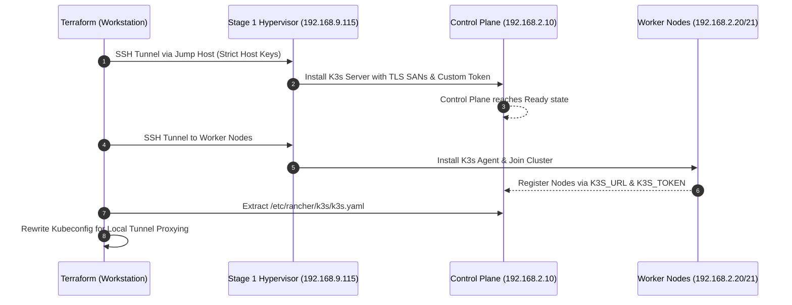

# Stage 3: Automated Kubernetes Distribution Bootstrapping (`03-k8s-bootstrap`)

This environment automates the distribution bootstrap, control plane initialization, worker node joining, and remote `kubeconfig` extraction for the downstream Kubernetes cluster provisioned in Stage 2.

## 📐 Architecture & Cluster Bootstrapping



---

## 🔒 Zero-Trust Security & Host Key Verification

All provisioning actions in Stage 3 connect to downstream nodes through the Stage 1 nested hypervisor jump host using the deterministic Ed25519 host keys generated in Stage 2:
- Host key file: `../02-k8s-cluster/.terraform/known_hosts`
- Flag enforcement: `-o UserKnownHostsFile=... -o StrictHostKeyChecking=yes`
- Prevents Man-in-the-Middle (MITM) attacks and eliminates interactive SSH host verification prompts.

---

## ⚡ Quick Start

```bash
# 1. Copy sample variables
cp terraform.tfvars.example terraform.tfvars

# 2. Initialize and apply Stage 3
terraform init
terraform plan
terraform apply

# 3. Access Kubernetes Cluster via SSH Tunnel
ssh -L 6443:192.168.2.10:6443 ubuntu@192.168.9.115
export KUBECONFIG=$(pwd)/kubeconfig.yaml
kubectl get nodes -o wide
```

<!-- BEGIN_TF_DOCS -->
## Requirements

| Name | Version |
|------|---------|
| <a name="requirement_terraform"></a> [terraform](#requirement\_terraform) | >= 1.0.0 |
| <a name="requirement_local"></a> [local](#requirement\_local) | >= 2.4.0 |
| <a name="requirement_null"></a> [null](#requirement\_null) | >= 3.2.0 |
| <a name="requirement_random"></a> [random](#requirement\_random) | >= 3.5.0 |

## Providers

| Name | Version |
|------|---------|
| <a name="provider_null"></a> [null](#provider\_null) | 3.3.0 |
| <a name="provider_random"></a> [random](#provider\_random) | 3.9.0 |

## Modules

No modules.

## Resources

| Name | Type |
|------|------|
| [null_resource.extract_kubeconfig](https://registry.terraform.io/providers/hashicorp/null/latest/docs/resources/resource) | resource |
| [null_resource.k3s_control_plane_bootstrap](https://registry.terraform.io/providers/hashicorp/null/latest/docs/resources/resource) | resource |
| [null_resource.k3s_worker_bootstrap](https://registry.terraform.io/providers/hashicorp/null/latest/docs/resources/resource) | resource |
| [null_resource.verify_k8s_cluster](https://registry.terraform.io/providers/hashicorp/null/latest/docs/resources/resource) | resource |
| [random_password.k3s_cluster_token](https://registry.terraform.io/providers/hashicorp/random/latest/docs/resources/password) | resource |

## Inputs

| Name | Description | Type | Default | Required |
|------|-------------|------|---------|:--------:|
| <a name="input_cluster_cidr"></a> [cluster\_cidr](#input\_cluster\_cidr) | Pod CIDR network range for internal cluster overlay | `string` | `"10.42.0.0/16"` | no |
| <a name="input_cluster_dns"></a> [cluster\_dns](#input\_cluster\_dns) | Cluster DNS Service IP | `string` | `"10.43.0.10"` | no |
| <a name="input_k3s_version"></a> [k3s\_version](#input\_k3s\_version) | K3s release version to install on control plane and worker nodes | `string` | `"v1.28.8+k3s1"` | no |
| <a name="input_k8s_control_plane_ip"></a> [k8s\_control\_plane\_ip](#input\_k8s\_control\_plane\_ip) | Static IPv4 address of the downstream Kubernetes control plane node | `string` | `"192.168.10.10"` | no |
| <a name="input_k8s_worker_ips"></a> [k8s\_worker\_ips](#input\_k8s\_worker\_ips) | List of static IPv4 addresses for downstream Kubernetes worker nodes | `list(string)` | <pre>[<br>  "192.168.10.21",<br>  "192.168.10.22"<br>]</pre> | no |
| <a name="input_nested_hypervisor_ip"></a> [nested\_hypervisor\_ip](#input\_nested\_hypervisor\_ip) | IP address or hostname of the Stage 1 Nested Sandbox hypervisor VM (used as SSH jump host) | `string` | n/a | yes |
| <a name="input_nested_hypervisor_user"></a> [nested\_hypervisor\_user](#input\_nested\_hypervisor\_user) | SSH user for authenticating with the nested hypervisor VM | `string` | `"ubuntu"` | no |
| <a name="input_service_cidr"></a> [service\_cidr](#input\_service\_cidr) | Kubernetes Service CIDR network range | `string` | `"10.43.0.0/16"` | no |
| <a name="input_ssh_known_hosts_path"></a> [ssh\_known\_hosts\_path](#input\_ssh\_known\_hosts\_path) | Local path to the SSH known\_hosts file for server host key verification | `string` | `"~/.ssh/known_hosts"` | no |
| <a name="input_ssh_private_key_path"></a> [ssh\_private\_key\_path](#input\_ssh\_private\_key\_path) | Local path to the SSH private key used for connecting to VMs | `string` | `"~/.ssh/id_ed25519"` | no |
| <a name="input_stage2_known_hosts_path"></a> [stage2\_known\_hosts\_path](#input\_stage2\_known\_hosts\_path) | Path to Stage 2 workspace-isolated known\_hosts file containing deterministic host keys | `string` | `"../02-k8s-cluster/.terraform/known_hosts"` | no |

## Outputs

| Name | Description |
|------|-------------|
| <a name="output_cluster_endpoint"></a> [cluster\_endpoint](#output\_cluster\_endpoint) | Direct HTTPS endpoint of the Kubernetes API server |
| <a name="output_control_plane_status"></a> [control\_plane\_status](#output\_control\_plane\_status) | Operational status of the K3s control plane node |
| <a name="output_k3s_control_plane_ip"></a> [k3s\_control\_plane\_ip](#output\_k3s\_control\_plane\_ip) | Static IPv4 address of the bootstrapped Kubernetes control plane node |
| <a name="output_k3s_version"></a> [k3s\_version](#output\_k3s\_version) | Installed K3s distribution version |
| <a name="output_k3s_worker_ips"></a> [k3s\_worker\_ips](#output\_k3s\_worker\_ips) | Static IPv4 addresses of the joined Kubernetes worker nodes |
| <a name="output_kubeconfig_path"></a> [kubeconfig\_path](#output\_kubeconfig\_path) | Local filesystem path to the extracted and configured workstation kubeconfig |
| <a name="output_kubectl_tunnel_command"></a> [kubectl\_tunnel\_command](#output\_kubectl\_tunnel\_command) | Alias for tunnel\_command providing SSH tunnel string for kubectl access |
| <a name="output_tunnel_command"></a> [tunnel\_command](#output\_tunnel\_command) | SSH port-forwarding command to access the Kubernetes API server securely from local workstation |
| <a name="output_worker_nodes_status"></a> [worker\_nodes\_status](#output\_worker\_nodes\_status) | Operational status of joined Kubernetes worker nodes |
<!-- END_TF_DOCS -->
